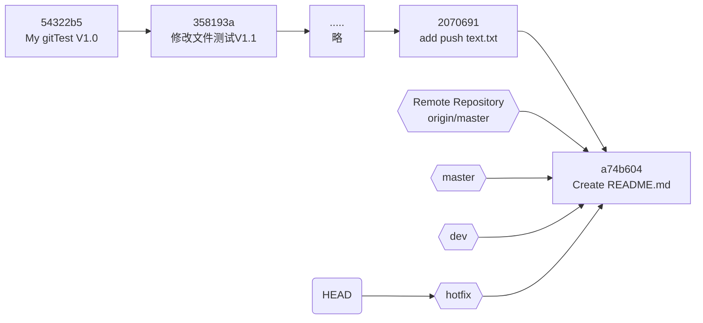
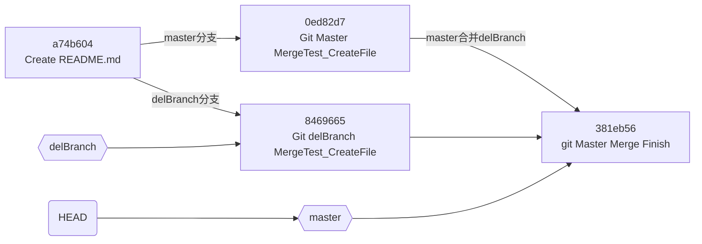

# **安装 Git for Windows**
***
[**官方下载地址**](https://gitforwindows.org/) ： https://gitforwindows.org/

选择合适自己系统的版本，我下载到的版本是Windows版“Git-2.37.1-64-bit.exe”。
下载完成后进行安装安装进行到Windows Explorer integration的时候，将选项中的"Git Bash Here"和"Git GUI Here"选中打钩：

一路Next，在选择默认编辑器时候按照个人需求选择：

一路Next，等待安装完成。

# **Git 使用**
***
## **Git 概览**

一张图解决一切问题：

图标区域说明：
* workspace: 工作目录，保存你操作的实际文件。
* staging: 暂存区，临时保存你的改动。
* Local repository: 本地仓库，保存你改动后生成的新版本。
* Remote repository: 远程仓库，用于将本地仓库数据上传到网络，实现备份，共享，合作。

## **本地使用**

### **创建本地仓库:**  

选择或者创建一个本地文件夹作为git的本地仓库，在此文件夹图标上右键，选择 ***"Git Bash Here"***：

在打开的命令行窗口输入：*`git init`*。完成之后，它会在这个目录下创建一个隐藏的文件夹 *.git*，用于保存本地仓库版本的相关信息，包括版本信息，仓库信息，以及git命令编译规则等。

### **添加文件**

添加文件到仓库需要两个步骤：
1. *`git add <filename>`* : 添加修改过的文件到暂存区。也可以使用 *`git add -A`* 一次性添加所有改动过的文件。
2. *`git commit -m "message"`* 提交暂存区的全部改动到本地仓库。message信息一般为**改动注释**，方便之后的管理以及检索。

**用实例说话：**
我们先在本地仓库文件夹下创建一个"git测试.txt"文件，输入内容：“这是一个git添加测试。”
  
然后,我们使用 *`git status`* 命令查看当前仓库状态是否有什么变化。
* *`git status`* 是一个对新手来说使用频率十分高的命令。它不仅可以查看当前仓库的状态，而且碰到问题时候，也可以通过查看它给出来的提示来解决问题。  

可以看到，它提示我们：nothing added to commit but untracked files present (use "git add" to track)，并提示可以我们可以使用 *`git add <file>...`* 来把它添加进去。嗯……不过这个文件名的中文显示不是我们想要的，给它设置一下：
输入：*`git config --global core.quotepath false`* 然后再看下：

现在中文名显示正常了。然后我们开始添加文件。因为懒得打文件名，所以直接使用 *`git add -A`*。嗯，什么提示都没有，因为没有坏结果就是一个好结果。然后我们再次使用 *`git status`* 命令查看当前仓库状态是否有什么变化。

状态变了。现在的提示变成No commits yet。我们通过add命令已经成功添加文件到暂存区了，只是还没有提交到本地版本库生成新的版本而已。
执行 *`git commit -m "message"`* 把暂存区修改提交到本地仓库，这里 *`"message"`* 我们填“My gitTest V1.0”。

出现了个提示：“Author identity unknown”，并且给了我们要怎么处理的步骤。因为我们初次提交，Git需要知道到底是谁执行了这次提交操作。我们根据提示分别输入：
*`git config --global user.name "Your Name"`*
*`git config --global user.email "Your Email"`*
顺便还可以输入 *`git config --list`* 查看下配置：

设置完成后，现在可以提交了，执行 *`git commit -m "My gitTest V1.0"`*

现在，就可以通过 *`git log`* 查看提交的记录了：

这样，我们就完成了添加文件到仓库的操作了。

### **修改文件**

我们现在对 “git测试.txt” 文件内容进行修改。修改为：
> git添加测试已通过。
> 这是一个git修改测试。

然后我们用 *`git status`* 查看下当前仓库状态。

看得出来，Git提示 “git测试.txt” 已经被修改过了。
我们使用 *`git diff`* 可以查看文件都有什么变化。

* *`git diff`* 是查看当前文件与最新的Commit版本二者之间的不同。
    红色（前面有个减号" - ")表示删除，绿色（前面有个加号" + ")表示添加。

因此，在git看来，这次修改我们是删除了原来的那一行内容，并且新添加了两行。

如果我现在想撤销目前这些修改，则执行 *`git checkout .`*。
* *`git checkout .`* 用来撤回修改过的但还未提交（add）到暂存区的内容。这里的 "." 表示撤销所有的修改。相当于放弃工作目录的所有改动，拷贝一份暂存区内容到工作目录。也可以使用 *`git checkout -- <file>`* 撤回指定文件的修改。

然后再用 *`git status`* 查看下仓库状态：

上一个执行status命令提示的修改都没有了，在看看工作目录下的文件现在变成了：

恢复成了我们修改过之前的内容了。

好了，我们再次修改 “git测试.txt” 文件内容为：
> git添加测试已通过。
> 这是一个git修改测试。

然后添加到暂存区：*`git add -A`*
再提交到本地仓库：*`git commit -m "修改文件测试V1.1"`* 
再查看下提交记录：*`git log`*

现在可以看到，本地仓库已经有两个版本了。

### **版本回退**

对于为什么需要版本回退就不多说了，往事不堪回首……
现在，我们的目的就是将文件退回到第一次commit时候的状态，即第一个版本。
首先，先看下现在文件状态：

注意“git测试.txt”的修改日期为：2022-7-19 9:47
我们看到本地仓库现在有两个版本：

两个版本对应的Commit黄字是我们需要注意的，一长串的16进制数，我们就当这个是我们提交之后Git自动设定的版本号。而“ **(HEAD -> master)** "则表示这个为当前的版本。
现在，执行 *`git reset --hard 54322b5`* （版本号使用前面7位即可）并用 *`git log`* 查看记录：

现在，HEAD已经指向我们指定的索引了，并且我们可以发现，之前的commit都被清除了！此时的文件状态：

文件“git测试.txt”修改日期已经变成了当前时间： 2022-7-19 11:04
文件内容也变回原来的最早commit的版本的内容了。这说明文档已经被重置，版本已经回退到我们指定的版本号了。

**划重点：**
***
* ***`git reset [--soft | --mixed | --hard] [HEAD]`*** : 
  * ***`--soft`*** ： 仅移动版本库HEAD，暂存区、工作区未改变。
    

    * ***`--mixed`*** ：移动版本库HEAD，重置暂存区，工作区未改变。
    

    * ***`--hard`*** : 移动版本库HEAD，重置暂存区，重置工作区。删除提交记录。慎用。
    
***

通过上面的 ***`git reset [--soft | --mixed | --hard] [HEAD]`*** 命令的解释，我们知道了只要执行 *`reset`* 命令，Git就会对HEAD进行操作，而Git也提供了对HEAD记录的查询指令： *`git reflog`*

reflog查询的结果：
* 第一行告诉我们版本号目前是“54322b5”，因为我们执行了 *`reset`* 操作，所以HEAD目前指向这个。
* 第二行指明这个版本的版本号是“358193a”，这是我们执行 *`commit`* 提交第二次修改时候生成的版本(message=修改文件测试V1.1)。
* 第三行指的版本号是“54322b5”，这个是第一次执行 *`commit`* 提交生成的版本，是最初的版本。

这时候我们再来进行一次 *`reset --hard`* 操作，将HEAD指向“358193a”版本，接着再查看log：

看，我们又回到了原来 *`reset`* 之前的状态了！

所以，我们能通过 *`reset`* 指令结合 *`reflog`* 查询HEAD记录来在指定版本中根据需要进行切换。

### **删除文件**

文件删除针对不同场景有两条指令：
* *`git clean`* : 删除工作区未被追踪的文件，即未使用 *`git add`* 操作过的文件。一般用于删除误添加的文件以及编译中生成的过程文件。
* *`git rm`* : 删除已被追踪的文件，对未被tracked的文件 *`rm`* 命令无能为力。*`git rm`* 可以将文件从工作区中和暂存库中删除。

#### *`git clean`* 操作：
* *`git clean -n ./`* : 查看当前目录下未被追踪的文件。
* *`git clean -f ./`* ：删除当前目录下未被追踪的文件。

我们先在工作目录下创建一个文件：

然后执行上面两个命令：

以上，就可以看出 *`git clean`* 的作用。

#### *`git rm`* 操作：
*`git rm`* 指令执行后，删除工作区跟暂存区的文件，同时还将删除操作记录下来。当进行 *`git commit`* 操作后，会把删除操作提交上去，使之在版本库中也被删除掉。
需要注意的是，*`git rm`* 要删除的文件必须是**没改过**的，要与当前版本库文件一致的才行。
* *`git rm -n <file>`* : 查看是否存在将被删除的文件。
* *`git rm <file>`* ：删除工作区与暂存区文件，并将删除操作记入。
* *`git rm -f <file>`* :强制删除工作区与暂存区文件，并将删除操作记入。

我们再来在工作目录下创建一个文件：

新添加文件处于未被追踪状态，然后我们先提交到暂存区。顺手把“git测试.txt"修改一下，等下可以做下对比。

我们先执行 *`git ls-files`* 查看暂存区中有哪些文件：

然后尝试删除它们：

可以看到，都失败了，提示的错误并不一样：
* “git测试.txt”文件，这个是我们提交到版本库过的，只是现在在工作区目录下被我们修改过了，所以删除不成功，因为这个是工作区与暂存区、版本库的文件不一致。
* “gitRM删除测试.txt”文件，这个是我们add到暂存区的，但未提交到版本库的，目前的版本库中没有这个文件，所以也删除不成功。因为这个是工作区、暂存区与版本库的文件不一致。

好了，我们先执行一次 *`git commit`* 操作，把暂存区的内容提交到版本库。这样“gitRM删除测试.txt”这个文件现在就在版本库中存在了。而“git测试.txt”这个文件其实相当于没变过。因为我们工作区的修改并没有add到暂存区。

然后尝试删除：

结果很显然，“git测试.txt文件”依然删除不掉，原因上面讲过了。而“gitRM删除测试.txt”现在已经从工作区跟暂存区被删除掉。
我们执行 *`git rm -f`* 来强制删除“git测试.txt”，“git测试.txt”终于从工作区跟暂存区删掉了。

当我们执行 *`git status`* 时候，可以看到删除记录都已经被保存了。现在只要 *`commit`* 提交，就可以再版本库中删除这两个文件了。

## 远程使用

我们这里以 **Github** 作为远程仓库为例。

### 1. **Github上注册账号**

这边不做详细介绍，自行百度。

### 2. **SSH KEY生成及配置**

因为本地仓库与Github仓库之间的传输是通过SSH加密的，因此，我们首先必须要先生成SSH Key。
执行 ***`ssh-keygen -t rsa -f <filename> -C "youremail@example.com"`***
* -t 参数： -t 参数值指定密钥类型。可以是 rsa | dsa | ecdsa 等。
* -f 参数： \<filename\>为保存密钥的文件名，建议文件名为id_xxx。xxx即为 -t 参数指定的密钥类型。不使用 -f 参数时候则在默认存储在当前用户home路径下的.ssh隐藏目录生成密钥文件。
* -C 参数： 这是个注释信息，以此为注释生成SSH Key。这里使用“youremail@example.com” email地址。

这边，我直接在本地仓库下建立了一个.ssh文件夹用来存放密钥，密钥文件名为id_ras。一路默认回车到SSH KEY生成完成。然后我们进入.ssh文件夹下可以看到有两个文件：私钥 **id_ras** 和 公钥 **id_ras.pub**。

打开**id_ras.pub**文件，复制里面的内容，然后打开Github官网，登录进账户。进入Settings。在左边栏目中选择SSH and GPG keys。点击New SSH key。把刚才复制的内容拷贝进去，顺手给这个key取个名字。点击Add SSH key提交完成。

准备工作完成，我们先来验证下是否成功：
输入命令： ***`ssh -T git@github.com`*** :

得到一个大大的惊喜： “ **git@github.com: Permission denied (publickey).** ”
因为我们前面已经在本地生成了SSH Key，并且公钥也拷贝到了github上，所以不可能是缺少SSH Key的问题，也不会是远端配置的问题。考虑到我们在生成密钥的时候指定了存放位置，不是存放于原来的默认位置。所以呢，应该是ssh命令在默认文件夹下没有找到密钥导致的错误。验证下： 
输入 ***`ssh-add -L`*** 查看密钥管理器中的公钥与 ***`ssh-add -l`*** 查看密钥管理器中的私钥：

又有错误，百度下“Could not open a connection to your authentication agent.”错误，原来要先执行 ***`ssh-agent bash`*** 。

果然，密钥管理器中啥都没。那么，我们需要手动把密钥添加到ssh的密钥管理器中：
执行 ***`ssh-add ./.ssh/id_rsa`*** ，然后再查看下密钥管理器中的密钥：

现在呢，密钥被添加进去了。我们再用 ***`ssh -T git@github.com`*** 尝试验证下：

完成！多折腾了这么多步骤，所以建议在生成密钥时候直接不带 *`-f`* 参数，这样后续就简单方便多了。

### 3. **远程仓库的操作管理**

#### 1. **在Github上创建远程仓库**

首先，我们先在Gtihub上创建一个远程仓库，方便之后的测试：

然后，我们要拷贝这个SSH以备用：

#### 2. **为Git添加远程仓库**

使用指令 ***`git remote add [remote-name] [url]`*** 来添加一个远程仓库。
* ***`[remote-name]`*** ：远程仓库的名字。
* ***`[url]`*** ：远程仓库的URL地址。

我们执行 ***`git remote add origin git@github.com:Niratman/git_remote_repository_for_test.git`*** ，origin后面的一串就是刚才拷贝的SSH内容。

静悄悄没反应的就是成功了。我们现在已经给Git指定了远程仓库为我们刚才在Github上创建的git_remote_repository_for_test这个仓库了。
如果出现 “ **fatal: not a git repository (or any of the parent directories): .git** ”错误的话是当前 **Git Bash** 运行目录没有初始化，只要执行一次 “ *`git init`* ” 就可以了。
我们可以使用以下几个命令来查询远程仓库的信息：
* *`git remote`* ：列出远程仓库名字。
* *`git remote -v`* ： 显示远程仓库信息。
* *`git remote show [remote-name]`* : 查看某个远程仓库的详细信息。

#### 3. **本地仓库推送到远程仓库**

使用指令 ***`git push [remote-name] [Local-Branch] : [Remote-Branch]`*** 来推送本地更新到远程仓库。
* ***`[remote-name]`*** ：远程仓库的名字。
* ***`[Local-Branch]`*** ：本地分支名字。如果省略本地分支名，则表示删除指定的远程分支，因为这等同于推送一个空的本地分支到远程分支。
* ***`[Remote-Branch]`*** ：远程分支名字。如果省略远程分支名，则表示将本地分支推送到与之存在“追踪关系”的远程分支（通常二者同名），如果远程分支不存在，则会被创建。

我们查看下现在本地仓库的情形：

这些是之前我们测试Git的本地使用时候的记录，而.ssh文件夹是刚才生成SSH Key时候建立的，先不管它。
我们使用： ***`git push -u origin master`*** 来把本地仓同步到远程仓库上，*`-u`* 参数指定默认的远程主机为origin，这样后面的推送就可以用不加任何参数的 ***`git push`*** 进行了，比较方便。

可以看到，现在在Github上的Master分支，已经存在了我们之前存在本地仓库的文件了。上传成功！

#### 4. **从远程仓库下载到本地仓库**

远程仓库下载数据到本地仓库也有两个指令：
* ***`git clone [url] <local directory>`*** : git clone 是从远程克隆一个完整的库到本地，本地并不需要新建立一个仓库。执行clone时候会自动在本地创建一个新的库。未指定本地目录名时候，拷贝回来的目录与远程版本库同名。
  * ***`git clone [url]`*** : 完整拷贝远程仓库至本地仓。
  * ***`git clone --branch [branch-name] [url]`*** 或者 ***`git clone -b [tag] [url]`*** : 克隆指定分支到本地仓。
* ***`git pull [remote-name] [Remote-Branch] : [Local-Branch]`*** : git pull 是从远程获取某个分支的更新并在本地的与指定分支合并。缺省本地分支时候，则与当前分支合并。执行 *`Git pull`* 相当于执行 *`Git fetch`* + *`Git merge`* 两个命令。

我们在Github上面建立的git_remote_repository_for_test仓库有两个分支,分别为main跟master：

##### *`git clone`* 操作：
现在我们使用clone命令拷贝main分支到本地git_remote_test_main_branch文件夹：
执行 ***`git clone --branch main git@github.com:Niratman/git_remote_repository_for_test.git git_remote_test_main_branch`*** ，稍微等待下传输：

我们可以看到，拷贝建立的新文件夹git_remote_test_main_branch里面包含着.git隐藏文件夹啊，所以这已经是一个完整的本地仓库了。我们可以对它进行正常操作：

##### *`git pull`* 操作：
我们回到原来的本地仓库中，现在准备用pull命令来拉取远程的master分支到本地。我们先把本地仓库恢复到最开始提交的状态
。

然后执行 ***`git pull origin master`***
提示：fatal：refusing to merge unrelated histories（拒绝合并不相关的历史）。在 git 2.9.2 之后，不可以合并没有相同结点的分支（分支之间自仓库建立后，从来没有过互相拉取合并）。如果需要合并两个不同结点的分支，我们要添加 *`--allow-unrelated-histories`*。再次执行 ***`git pull origin master --allow-unrelated-histories`*** ：

简单的pull操作完成。

#### 5. **练手**

我们新建一个文件“git推送测试.txt”,并提交到本地仓库：

然后推送到远程仓库：

现在可以在远程仓库上看到我们刚刚提交的新文件了。

我们在Github页面上为仓库git_remote_repository_for_test的master分支新建立了一个Readme文件。

现在把它拉到本地仓库：

这次只用输入： ***`git pull origin master`*** 就可以了，因为我们上一次执行pull带 ***`--allow-unrelated-histories`*** 时候已经关联了远程跟本地分支了，就不会在出现“refusing to merge unrelated histories”的错误了。

## 分支Branch

还是用一张图来说明：

* Master: 主分支。稳定的版本分支，正式的发布版本都从Master获取。不能直接在Master分支进行开发。
* Develop: 开发主分支。更新和变动最频繁的分支，正常情况下所有新功能开发都是以Develop分支来创建自己的开发分支，Develop分支只做合并操作，不能直接在该分支上开发。
* Features: 功能开发分支。从Develop上创建的分支，以开发的功能模块命名。Feature开发完成后合入Develop分支。
* Release：预发行分支。一般来说，代表一个版本的功能全部开发完成后递交测试，测试出Bug后进行修复的分支。
* HotFix: 最希望不会被创建的分支；这个分支的存在是在已经正式上线的版本中，发现了重大Bug进行修复的分支。

### 1. **分支查询**

其实从远程仓库操作开始，我们就已经开始接触到了分支的应用。那我们第一次接触分支是什么时候呢？其实在一开始使用Git初始化本地仓库的时候，就已经开始接触了。*`git init`*命令在创建仓库的时候，默认创建了一个master分支。我们在第一次用 *`git status`* 的时候，就可以看到了：

它告诉你：“On branch master”，现在处于master分支上。
既然我们现在正式的开始学习分支，那怎么也不能使用 *`git status`* 这种迂回的手段来查看分支，我们使用专门的命令来查询分支情况：
* ***`git branch`***
  * 带 *`--list`* 或者不带参数：列出本地现有的分支，当前分支以绿色突出显示，并标记有 **\*** 号。
  * 带 *`-r`* 参数： 列出远程分支。
  * 带 *`-a`* 参数： 列出本地跟远程的所有分支。
  * 带 *`-v`* 参数： 查看分支与分支最近一次提交的信息。
  * 带 *`-vv`* 参数： 查看分支与分支最近一次提交的信息,如果是本地分支则列出本地与远程分支的关系。

master为本地分支，**\*** 号标明其为当前分支。红色字符标记远程分支。*`-v`* 则可以查看分支最后一次的commit信息。*`-vv`* 参数如果本地分支与远程分支有追踪关系则会用蓝色字符标识出来。

### 2. **创建分支**

#### **创建本地分支**

建立本地分支有两个方式：
* ***`git branch [branch-name]`*** ： 创建一个名为“branch-name”的分支，当前分支不变。
* ***`git checkout -b [branch-name]`*** ： 创建一个名为“branch-name”的分支并切换到此分支下。

我们的当前分支是master，执行 ***`git branch dev`*** 创建了一个dev分支后，可以看到只是创建了分支，当前分支依然是master。然后我们执行 ***`git checkout -b hotfix`*** 创建了一个hotfix分支，可以看到提示“Switched to a new branch 'hotfix' ”，当前分支切换到了hotfix分支上。最后我们查询了下分支的结构关系：dev、hotfix、master三个分支commit信息都是一样的，并且与remotes/origin/master远程分支也一样。这是因为本地的master分支是我们上面从远程仓库的master分支上pull下来的，并且未做过改变。而dev、hotfix分支也都是我们在master未做改变时候创建的。这几个分支其实都指向的是同一个commit。我们先看下目前本地仓历次的提交信息：

图标大概可以这么表示：
* 矩形指代各个历史版本。
* 六角形指代各个分支。
* 圆角矩形指代HEAD指针。

#### **创建远程分支**

创建远程分支其实与创建本地分支一样，只是多了一个步骤，即把本地分支推送到远程仓库就可以了。
执行 ***`git push [remote-name] [Local-Branch] : [Remote-Branch]`*** 若远程分支不存在，则会自动创建远程分支。

回到master分支，建立一个delBranch分支（这个名字为了删除分支操作方便起的）：

然后切换到delBranch分支：

把delBranch分支推送到远端仓库：

就是这么简单！

### 3. **合并分支**

现在先回到master，我们新建一个gitMaster_MergeTest.txt文件，输入点内容，然后查看下当前状态：

我们可以看到，现在有两个未被追踪的文件：一个就是刚才新添加的gitMaster_MergeTest.txt，另外一个是我们之前使用clone指令创建的分支文件夹。这个先不管它。我们对gitMaster_MergeTest.txt文件进行add，然后添加进本地仓库。

现在master的版本号已经改变喽。然后，我们回到delBranch分支：

工作区的目录又回到原来状态了，这就是Git分支的强大之处。
现在，我们来创建两个新文件，gitMaster_MergeTest.txt和gitDelBarnch_MergeTest.txt,输入点内容，其中gitMaster_MergeTest.txt输入的内容跟我们在Master分支时候创建的同名文件输入内容不一样。

同样的，add新添加的文件然后提交：

准备工作都做完了，真正开始合并的时候了。我们回到Master分支，然后合并delBranch分支。
执行 ***`git merge [branch-name]`*** 进行合并分支操作：

内容有点多，我们一个一个分析：
1. 首先我们 *`git checkout master`* 回到master分支，git返回信息告诉我们master分支本地仓库我们有一个commit提交。还提示可以push推送至远程仓库。
2. 我们执行 *`git merge delBranch`* 合并delBranch分支，提示了gitMaster_MergeTest.txt有冲突。**因为两个分支我们都创建了这个文件并且内容是不一样的。** 打开gitMaster_MergeTest.txt文件，我们看到了文件内容已变化，多了一些特殊符号的行：
    * 符号 “ <<<<<<< HEAD ” 指示这是当前分支，下面跟的是当前分支下冲突文件的内容。
    * 符号 “ ======= ” 表示当前分支的冲突文件内容结束，下面跟的是合并分支的冲突文件的内容。
    * 符号 “ >>>>>>> delBranch ” 指明合并分支的名称，合并分支的冲突文件内容结束。
3. 执行 *`git status`* ，首先提示我们当前处于Master分支，然后对于合并分支带来的问题提示是解决冲突然后提交，还是直接忽略这个合并。最后提示合并分支带来的新的文件需要提交。

我们现在解决合并的冲突，修改gitMaster_MergeTest.txt：删除特殊符号，修改文件内容为我们真正想要的内容。然后add冲突文件，完成后提交到本地仓库，实现版本更新。

现在的本地版本图标大概可以这么表示：
* 矩形指代各个历史版本。
* 六角形指代各个分支。
* 圆角矩形指代HEAD指针。

总结下合并分支步骤：
1. 进入需要合并的分支。
2. 使用merge合并其他分支。
3. 查看合并后状态，如果有冲突的话，解决冲突，然后add冲突文件到暂存区。
4. 提交Merge结果到版本库，实现版本更新。
5. 看需求push提交到远程仓库。

### 4. **删除分支**

#### **删除本地分支**

执行分支删除命令：
***`git branch (-d | -D) <branch-name>`*** :
* *`-d`* 参数： 删除branch-name分支。该分支必须已经合并到上游分支，否则会报错。为的是防止修改内容丢失。
* *`-D`* 参数： 强制删除branch-name分支。相比较上面的 *`-d`* 参数，不做检测忽略修改直接删除。

我们可以通过 ***`git branch --merged`*** 来查找所有已经合并过，可以安全删除的分支。使用 ***`git branch --no-merged`*** 来查找还未合并过的分支。
为了说明二者差异，我们新建立一个noMergeBranch分支，新添加文件提交版本库来创建一个新的未被合并的分支：

然后回到master分支，使用 *`git branch --merged`* 和 *`git branch --no-merged`* ，现在，我们就可以看到差别了：

那么删除分支delBranch与分支noMergeBranch有什么差别呢：

执行 *`git branch -d`* 命令时候，delBranch分支直接就删除了，而noMergeBranch删除则报错，提示not fully merged。并且给出提示如果我们真要删除的话，使用 *`git branch -D`* 命令。

OK!,使用 *`git branch -D noMergeBranch`* 完美删除noMergeBranch分支。

**注意：不能删除当前所在分支**

我们从master分支切换到dev分支，然后删除dev分支，结果会报错提示无法删除，需要先checkout到其他分支。于是我们切换到了master分支，然后再执行删除dev分支指令，这样就可以正常删除dev分支了。

#### **删除远程分支**

使用指令 ***`git push [remote-name] -d [Remote-Branch]`*** 来删除远程分支。
试验下：首先，我们先查询下远程有哪些分支：

看到了之前我们介绍创建远程分支时候特别创建的delBranch了。然后我们对它进行删除：

执行删除完毕后，在Github上面已经没有delBranch分支了。